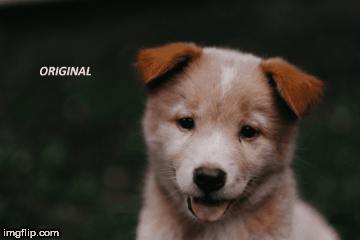

# Computer Vision course by Jose Portilla - Udemy

This repo includes my work for Udemy's Computer Vision course authored by Jose Portilla.
You can find the course [here].(https://www.udemy.com/python-for-computer-vision-with-opencv-and-deep-learning/)

### Requirements
- Anaconda Environment specification is provided in course. Install required package and start course.

### Section 1 : Course Overview and Introduction
- It is introduction of course and requirement specification

### Section 2 : NumPy and Image Basics
- Basic introduction to Numpy and Image.
- Played with color channel of image in numpy.You can find the gif of results 

 

### Section 3 : Image Basics with OpenCV
- Basic operation on Images using OpenCV
- Drawing basic shapes
- Mouse event handling using OpenCV and Python

### Section 4 : Image Processing
- Color mapping of image: RGB,HSV,HLS
- Blending and Pasting of Image
- Blurring of Image using Gaussian filter, Median filter and filter from scratch
- Morphological Operators like erosion,dilation,Opening,closing
- Also Includes Sobel filters and Histogram Manipulation

### Section 5 : Video basics with OpenCV
- Capturing and Saving live video
- Interacting live feed data from Webcam
- Opening a Video File and Performing Operations over it.

### Section 6 : Object Detection with OpenCV
- Template matching
- Corner Detection
- Edge Detection
- Grid Detection
- Feature Detection

